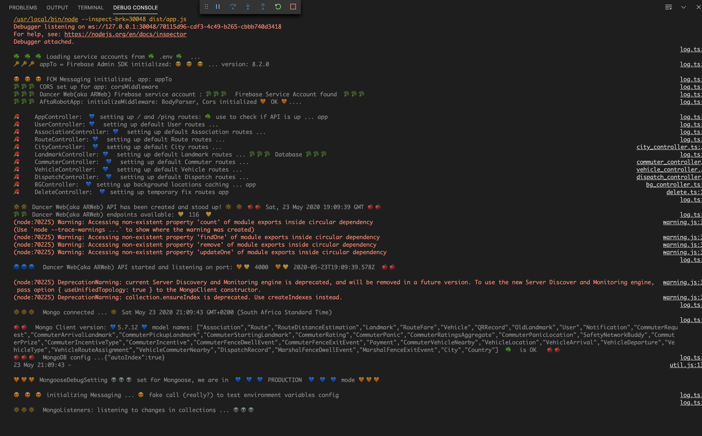
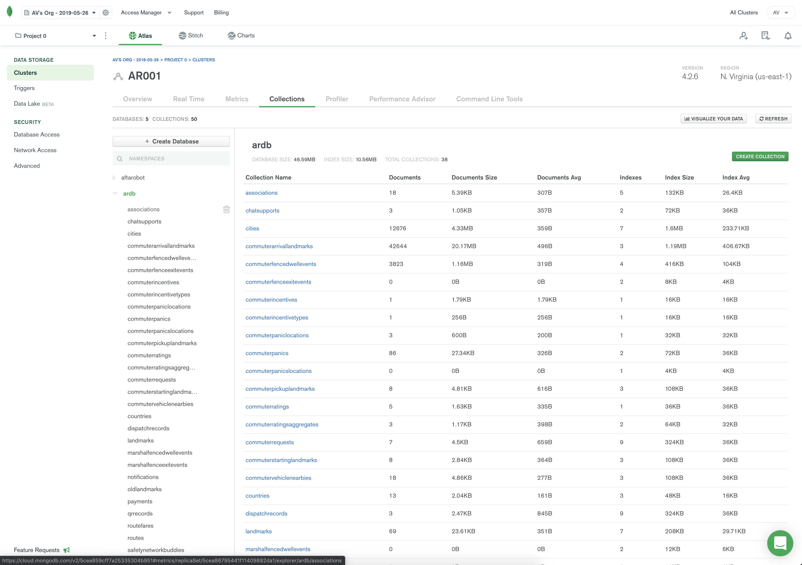

# dancer-repo

The AftaRobot backened API is manifested in the *NodeJS* *TypeScript* code in this repo. The API supports a suite of mobile apps that create and consume data from a MongoDB Atlas database. The API is deployed as a *Docker* container within a Kubernetes cluster and has been tested to deploy and run on *Azure, Google Cloud and AWS*.

